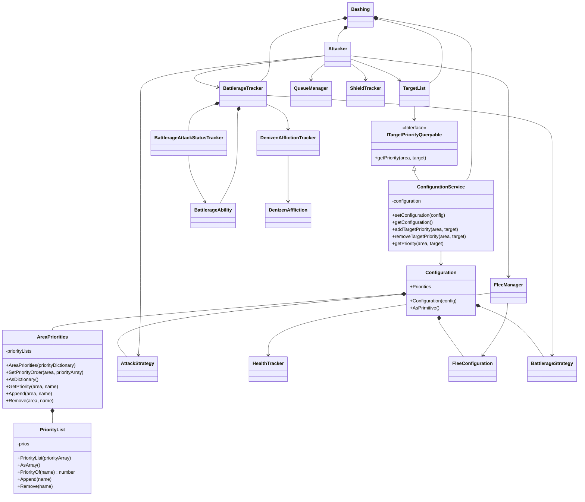

# Interactions between classes

## Class diagram

```mermaid
classDiagram

class PriorityList{
  -prios
  +PriorityList(priorityArray)
  +AsArray()
  +PriorityOf( name) number
  +Append(name)
  +Remove(name)
}

class AreaPriorities{
  -priorityLists
  +AreaPriorities(priorityDictionary)
  +SetPriorityOrder(area, priorityArray)
  +AsDictionary()
  +GetPriority(area, name)
  +Append(area, name)
  +Remove(area, name)
}

class Configuration{
  +Priorities
  +Configuration(config)
  +AsPrimitive()
}

class ConfigurationService{
  -configuration
  +setConfiguration(config)
  +getConfiguration()
  +addTargetPriority(area, target)
  +removeTargetPriority(area, target)
  +getPriority(area, target)
}

class ITargetPriorityQueryable{
  <<Interface>>
  +getPriority(area, target)
}

Bashing *-- TargetList
Bashing *-- Attacker
Bashing *-- BattlerageTracker
Bashing *-- ConfigurationService

ITargetPriorityQueryable <|-- ConfigurationService
ConfigurationService --> Configuration


AreaPriorities *-- PriorityList

TargetList --> ITargetPriorityQueryable

Attacker --> TargetList
Attacker --> QueueManager
Attacker --> BattlerageTracker
Attacker --> AttackStrategy
Attacker --> ShieldTracker
Attacker --> FleeManager

FleeManager --> HealthTracker
FleeManager --> FleeConfiguration

BattlerageTracker *-- BattlerageAbility
BattlerageTracker *-- BattlerageAttackStatusTracker
BattlerageTracker --> BattlerageStrategy
BattlerageTracker --> DenizenAfflictionTracker

BattlerageAttackStatusTracker --> BattlerageAbility

DenizenAfflictionTracker --> DenizenAffliction

Configuration *-- AttackStrategy
Configuration *-- FleeConfiguration
Configuration *-- BattlerageStrategy
Configuration *-- AreaPriorities

```
